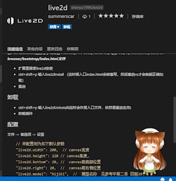

# live2d README

某人的一个无聊想法，然后一个无聊的下午 写了第一个vs扩展

实现参考： [video](https://marketplace.visualstudio.com/items?itemName=kangping.video)扩展，用背景来播放视频...这个也很无聊的

## 原理

vscode基于electron，拥有一个index.html的静态文件，我要做的就是重写这个index.html加入相应的script标签和js 就行了，然而这样会被检测出vscode出错，这个没办法了

## 注意

* windows系统下需要管理员权限 （右击图标-兼容性-以管理员运行）
* mac系统下 在应用目录-vscode-查看简介-最下方修改-读与写权限

## 安装

**输入live2dInstall前务必手动备份 Microsoft VS Code/resources/app/out/vs/workbench/electron-browser/bootstrap/index.html文件**

**输入live2dInstall前务必手动备份 Microsoft VS Code/resources/app/out/vs/workbench/electron-browser/bootstrap/index.html文件**

**输入live2dInstall前务必手动备份 Microsoft VS Code/resources/app/out/vs/workbench/electron-browser/bootstrap/index.html文件**

* 扩展里搜索live2d安装
* ctrl+shift+p 输入live2dInstall （这时候入口index.html会被重写，然后重启vs才会就能正确加载）
* 重启

## 卸载

* ctrl+shift+p 输入live2dUninstall(这时会恢复入口文件，依然是重启生效)
* 卸载插件
* 若仍报错，将备份的index.html再放回去就行了

## 配置

**修改配置后执行live2dInstall再重启才生效**

配置： 文件 -> 首选项 -> 设置

```json
    // 未配置则为如下默认参数
    "live2d.width": 200,  // canvas宽度
    "live2d.height": 220 // canvas高度,
    "live2d.bottom": 20, //  canvas距底部位置
    "live2d.right": 20,  //  canvas距右侧位置
    "live2d.model": "hijiki",  //  模型名称  见参考中第二条 目前26个
    "live2d.headPos": 0.5,  // 重心
    "live2d.scale": 2, // 缩放(貌似无效..)
    "live2d.opacity": 0.7, // 透明度
    "live2d.hoverOpacity": 1 // hover透明度
    "live2d.canHover": true // 是否开启hover效果(鼠标穿透)
```

## 1.0.0

Initial release of ...

## 其他参考

* [hexo-live2d ](http://summerscar.me/2018/01/17/%E7%94%A8live2d%E7%BB%99%E5%8D%9A%E5%AE%A2%E5%8A%A0%E4%B8%AA%E5%8D%A1%E5%93%87%E4%BC%8A%E7%9A%84%E6%8C%82%E4%BB%B6/)
* [我自己的模型Demo（配置项model）](https://github.com/summerscar/live2dDemo)
* [bilibili看板娘](https://github.com/52cik/bilibili-haruna)
* [live2d 3.0](https://github.com/xiazeyu/live2d-widget.js)

## 预览

